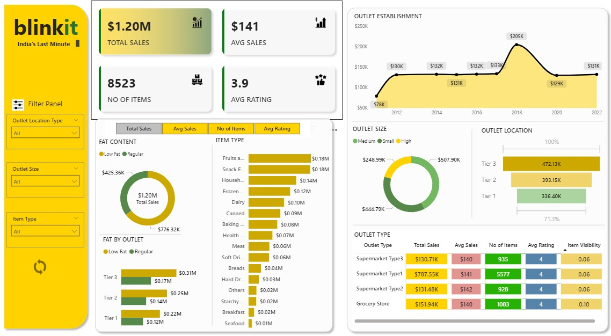

# 🛒 Grocery Data Analysis Dashboard  
_A PowerBI Dashboard analyzing sales and customer trends for a Quick Commerce company_

  

## 📌 Project Overview

This project analyzes the grocery sales dataset of a Quick Commerce company operating in India. The dataset contains sales information for food items across 12 columns (for example, product name, weight, sales, amount of fat included, and customer rating). The objective is to drive improvements in business operations, enhance customer satisfaction, and optimize product assortment and store layout.

The dashboard is created using:
- 📊 **PowerBI** for data visualization
- 📂 **Kaggle's Blinkit Grocery Dataset** for input data

---

## ✅ Key Features
- Sales breakdown by product categories and store types
- Total sales, average sales, number of products, and customer ratings
- Filtering capabilities for category-wise and store-wise performance analysis
- Visual insights into customer behavior and sales trends

---

## ⚙️ Workflow

### 1. Data Collection and Preprocessing
- Downloaded the **Blinkit Grocery Dataset** from Kaggle
- Loaded the data into **PowerBI**
- Performed data cleaning and preprocessing

### 2. Data Analysis and Visualization
- Performed insights and metric calculations:
  - Total and average sales
  - Number of products
  - Customer feedback analysis
- Created multiple PowerBI visuals:
  - Clustered & stacked bar charts
  - Donut charts
  - Line graphs
  - Funnel charts
  - Matrix tables

---

## 🛠️ Tools Used
- **PowerBI** for interactive dashboards and reports
- **Excel / CSV** for dataset input (from Kaggle)

---

## 📁 Project Structure
- `blinkitAnalysis.pbix`: PowerBI dashboard file
- `BlinkIT Grocery Data.xlsx`: Source dataset
- `README.md`: This documentation file
- `images used/`: folder that contains the images used for icons

---

## 📈 Example Insights
- Identify top-performing product categories
- Spot seasonal trends in sales
- Analyze which stores or products receive the highest customer ratings
